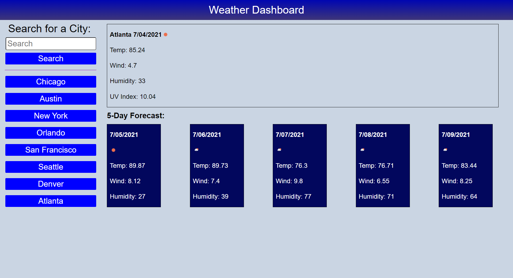

# weather-dashboard_BG

## HTML
* _Sidebar_
* Contains form with search elements
* The search works great (finally!), but the buttons do not
* In the future, I would like to add error handling if a search is not valid

* _Main_
* Contains box header with current day's weather and 5 cards that display the following day's weather
* Temperature, Wind, Humidity, and UV Index (in header) are dynamically updated
* An image icon on the cards is also dynamically updated based on the weather condition

## CSS
* _Title Bar_
* Dark blue linear gradient background color

* _Sidebar_
* Items centered with flexbox properties

* _Main_
* Everything is a flexbox
* Flex seemed to be the easiest to use here, but grid could also have been applicable and would have required less code in hindsight
* Navy blue background color for cards and buttons

## JS
* _Search_
* User input (submission of the form) updates the main fetch link parameter through localStorage
* The localStorage is set based on the value of the user search input

* _Header_
* The header is updated separately from the cards
* The city is updated through the local storage search value
* The date is dynamically generated with the built-in Date() function
* getDate splits, slices, and splits the Date() again to capture an array of respective months, days, and years
* makeCardDates formats the dates for the header and cards with slashes
* The weather icon is dynamically updated through One Call's server, and relies on the code being added to an image source URL with the same for loop updating the forecastObj (which I'll get to later in the README)
* The other elements are updated dynamically with the same forecastObj

* _Main_
* After the initial fetch call that searches for a city by name to get the latitude and longitude coordinates, another URL is generated that searches by those coordinates
* This fetch call pushes the relevant JSON derived data to a forecast object, forecastObj, that will be used for updating the Temperature, Wind, Humidity, and UV Index (in header)
* The header is updated first since it contains extra elements (City, UV Index)
* The cards are then updated with a for loop that creates the inner HTML of their respective divs

## LINKS
* https://github.com/WorldUnfurled/weather-dashboard_BG
* https://worldunfurled.github.io/weather-dashboard_BG/

;
